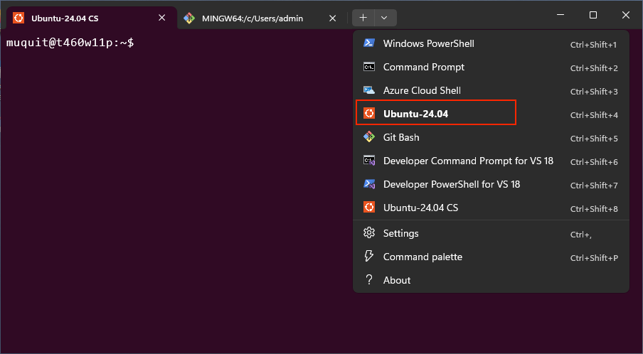

# Table Of Contents
- [windows 11 for unix users](#windows-11-for-unix-users)
- [requirements](#requirements)
- [shell and ssh](#shell-and-ssh)
  - [git bash](#git-bash)
  - [ssh into windows](#ssh-into-windows)
    - [make git bash the default ssh shell](#make-git-bash-the-default-ssh-shell)
  - [wsl 2 and ubuntu](#wsl-2-and-ubuntu)
  - [ssh into wsl 2 directly](#ssh-into-wsl-2-directly)
    - [use mirrored networking](#use-mirrored-networking)
    - [move the wsl ssh server to port 2222](#move-the-wsl-ssh-server-to-port-2222)
    - [password authentication](#password-authentication)
- [docker and podman](#docker-and-podman)
  - [docker desktop](#docker-desktop)
  - [podman](#podman)
- [remote desktop](#remote-desktop)
  - [enable remote desktop on windows](#enable-remote-desktop-on-windows)
  - [connect from linux](#connect-from-linux)
    - [freerdp](#freerdp)
    - [remmina](#remmina)
  - [connect from mac](#connect-from-mac)
- [prevent windows 11 from sleeping](#prevent-windows-11-from-sleeping)
- [compiling](#compiling)
  - [mingw vs visual studio](#mingw-vs-visual-studio)
  - [mingw runtime dll problem](#mingw-runtime-dll-problem)
  - [fix: static linking](#fix-static-linking)
- [troubleshooting](#troubleshooting)
  - [check wsl 2](#check-wsl-2)
  - [wsl ssh connection times out](#wsl-ssh-connection-times-out)

# windows 11 for unix users

These are my notes on setting up a Windows 11 machine for someone coming
from Unix, Linux or macOS.

Without a proper shell, ssh and a real Linux environment, Windows is mostly
useless to me. I do not use Office or many native Windows applications, but
at times I need Windows for my various open source projects.

I cleaned up my setup notes so my Unix/Mac friends can use them without
repeating the same trial and error. I hope you find them useful as well.

This document covers the following:

* A usable Bash shell with [Git Bash](https://git-scm.com/install/windows)
* ssh access to Windows
* An Ubuntu environment with WSL 2, also reachable over ssh
* Docker and Podman
* Remote Desktop access from Linux or Mac
* Compiling native Windows programs with [mingw-w64](https://www.mingw-w64.org/) or [MS Visual Studio Community Edition](https://visualstudio.microsoft.com/vs/community/)


# requirements

* Windows 11. Home is enough for [Git Bash](https://git-scm.com/install/windows), OpenSSH, WSL 2, Docker Desktop
  and Podman. Windows 11 Pro is needed to host an RDP session.
* Administrator access


# shell and ssh

## git bash

Install [Git Bash](https://git-scm.com/install/windows). It gives you Bash, Git, ssh and many familiar Unix
commands. This alone makes Windows much more usable for me.

Git Bash is not a complete Linux environment. Use WSL 2 when you need one.

## ssh into windows

Windows 11 includes an optional OpenSSH server. Go to **Settings > System >
Optional features**, select **View features**, search for **OpenSSH Server**
and install it.

You can also install it from an elevated PowerShell:

```powershell
Add-WindowsCapability -Online -Name OpenSSH.Server~~~~0.0.1.0
```

If that command or the Settings application hangs, try DISM:

```powershell
DISM /Online /Add-Capability /CapabilityName:OpenSSH.Server~~~~0.0.1.0
```

Start the service and arrange for it to start with Windows:

```powershell
Start-Service sshd
Set-Service -Name sshd -StartupType Automatic
```

Test it from another machine:

```bash
ssh username@<windows-ip-or-tailscale-name>
```

The default shell is `cmd.exe`.

### make git bash the default ssh shell

Windows OpenSSH reads its default shell from the registry. Run the following
commands from an elevated PowerShell:

```powershell
New-ItemProperty -Path "HKLM:\SOFTWARE\OpenSSH" -Name DefaultShell -Value "C:\Program Files\Git\bin\bash.exe" -PropertyType String -Force
Restart-Service sshd
```

Adjust the path if Git Bash is installed elsewhere. Log in again and you
should get Bash instead of Command Prompt.

This setting affects every OpenSSH login to the Windows host. You can still
run `cmd.exe` or `powershell.exe` from Bash. To restore the default, use:

```powershell
Remove-ItemProperty -Path "HKLM:\SOFTWARE\OpenSSH" -Name DefaultShell
Restart-Service sshd
```

## wsl 2 and ubuntu

From an elevated PowerShell, install WSL 2 and Ubuntu:

```powershell
wsl --install -d Ubuntu
```

Restart Windows if requested, launch Ubuntu and create your Linux user. You
can return to it later by running `wsl` from PowerShell or Windows Terminal.



## ssh into wsl 2 directly

Running `bash` after logging in to Windows starts Git Bash, not Ubuntu. If
you want to log directly into Ubuntu, install its own OpenSSH server:

```bash
sudo apt update
sudo apt install openssh-server
sudo systemctl enable --now ssh
```

Recent WSL installations enable systemd by default. Check it with:

```bash
systemctl is-system-running
```

If systemd is not enabled, add this to `/etc/wsl.conf`:

```ini
[boot]
systemd=true
```

Then run `wsl --shutdown` from PowerShell and launch Ubuntu again.

### use mirrored networking

By default, WSL 2 uses NAT and its virtual-machine IP address can change.
Windows 11 22H2 and later support mirrored networking, which makes services
in WSL directly reachable from the LAN and generally works better with VPNs.

Create `%UserProfile%\.wslconfig` on Windows:

```ini
[wsl2]
networkingMode=mirrored
```

Restart WSL from PowerShell:

```powershell
wsl --shutdown
```

If the connection times out, see [wsl ssh connection times out](#wsl-ssh-connection-times-out).

### move the wsl ssh server to port 2222

Windows OpenSSH normally uses port 22. I use port 2222 for the ssh server in
Ubuntu so it is always clear which system I am connecting to.

Edit `/etc/ssh/sshd_config` in Ubuntu and add:

```text
Port 2222
```

Ubuntu may use systemd socket activation for ssh. The socket can continue to
listen on port 22 even after changing `sshd_config`. Disable the socket and
enable the regular service:

```bash
sudo systemctl disable --now ssh.socket
sudo systemctl enable --now ssh.service
sudo systemctl restart ssh.service
```

Confirm that Ubuntu is listening on port 2222:

```bash
sudo ss -tlnp | grep ':2222'
```

Then connect from another machine:

```bash
ssh -p 2222 username@<windows-ip-or-tailscale-name>
```

Port 22 should reach Windows and port 2222 should reach Ubuntu.

### password authentication

If login fails with `Permission denied`, inspect the effective setting:

```bash
sudo sshd -T | grep passwordauthentication
```

If necessary, set the following in `/etc/ssh/sshd_config` and restart ssh:

```text
PasswordAuthentication yes
```

```bash
sudo systemctl restart ssh.service
```


# docker and podman

Both Docker Desktop and Podman can run Linux containers with WSL 2. This
works on Windows 11 Home; you do not need the Hyper-V role or Windows 11 Pro.

## docker desktop

Install [Docker Desktop](https://docs.docker.com/desktop/setup/install/windows-install/)
and select the WSL 2 backend. To use `docker` from Ubuntu, open Docker
Desktop, go to **Settings > Resources > WSL Integration** and enable your
Ubuntu distribution. The command is also available from PowerShell after
Docker Desktop updates the Windows `PATH`.

## podman

Install [Podman Desktop](https://podman-desktop.io/docs/installation/windows-install)
and use the WSL 2 provider. The Hyper-V provider also works on Windows 11
Pro, but I do not need it.


# remote desktop

Windows 11 Pro, Enterprise and Education can accept Remote Desktop (RDP)
connections. Windows 11 Home includes the client but cannot act as an RDP
server.

## enable remote desktop on windows

Go to **Settings > System > Remote Desktop** and turn on **Remote Desktop**.

## connect from linux

### freerdp

I mostly use `xfreerdp3` from an Ubuntu desktop:

```bash
sudo apt install freerdp3-x11
xfreerdp3 /u:youruser /v:<windows-ip-or-tailscale-name>
```

### remmina

If you prefer a GUI, install [Remmina](https://remmina.org/):

```bash
sudo apt install remmina remmina-plugin-rdp
```

## connect from mac

Install [Windows App](https://apps.apple.com/app/windows-app/id1295203466),
formerly called Microsoft Remote Desktop, from the App Store. Add a PC using
the Windows IP address or Tailscale name.

For day-to-day work I use ssh. RDP is mainly useful when I need the Windows
desktop, Device Manager, Lenovo Vantage or a GUI installer. If the machine
becomes unreachable after a while, see
[prevent windows 11 from sleeping](#prevent-windows-11-from-sleeping).


# prevent windows 11 from sleeping

If you use ssh or RDP, the Windows machine must stay awake. Turning off the
display is fine; putting the computer to sleep disconnects it from the
network.

Go to **Settings > System > Power & battery > Screen, sleep & hibernate
timeouts** and set the sleep and hibernate timers to **Never**.

On a laptop, also open **Control Panel > Hardware and Sound > Power Options >
Choose what closing the lid does** and set **When I close the lid** to **Do
nothing**.

If the machine still sleeps, check the vendor's power application. On my
Lenovo laptop, I also check Lenovo Vantage.

If the machine remains awake but ssh or RDP disconnects, open the network
adapter in Device Manager. If it has a **Power Management** tab, uncheck
**Allow the computer to turn off this device to save power**.


# compiling

## mingw vs visual studio

[mingw-w64](https://www.mingw-w64.org/) is enough for most of my native Windows programs and does not
require Visual Studio. Use [MS Visual Studio Community Edition](https://visualstudio.microsoft.com/vs/community/) or Visual Studio Build Tools when
a project specifically requires the MSVC compiler, Microsoft libraries or
Windows SDK tools that are not available with mingw-w64.

## mingw runtime dll problem

Programs compiled with mingw-w64 may depend on its GCC and C++ runtime DLLs.
Those DLLs will not normally be present on a Windows machine without the
same toolchain installed.

For example, [mbasecalc](https://www.muquit.com/muquit/software/mbasecalc/mbasecalc.html),
which uses FLTK, needed `libgcc_s_seh-1.dll` next to the executable when I
compiled it with mingw-w64. The version compiled with Visual Studio did not
need the GCC runtime DLL.

## fix: static linking

For GCC and libstdc++, try linking the runtime statically:

```
-static -static-libgcc -static-libstdc++
```

Add these to the linker flags. It does not work with every project.


# troubleshooting

## check wsl 2

Run from PowerShell:

```powershell
wsl --status
wsl --list --verbose
```

The second command shows the installed distributions and whether each one
uses WSL 1 or WSL 2. Update WSL if necessary:

```powershell
wsl --update
```

## wsl ssh connection times out

Make sure ssh is listening inside Ubuntu:

```bash
sudo ss -tlnp | grep ':2222'
sudo systemctl status ssh.service
```

Test it from Windows:

```powershell
Test-NetConnection -ComputerName localhost -Port 2222
```

If localhost works but another machine cannot connect, allow port 2222
through the Hyper-V firewall used by WSL mirrored networking. Run from an
elevated PowerShell:

```powershell
New-NetFirewallHyperVRule -Name "WSL-SSH" -DisplayName "WSL SSH" -Direction Inbound -VMCreatorId '{40E0AC32-46A5-438A-A0B2-2B479E8F2E90}' -Protocol TCP -LocalPorts 2222
```


---
<sub>TOC/glossary expansion by https://github.com/muquit/markdown-toc-go v1.0.6 on Sep-01-2026</sub>
